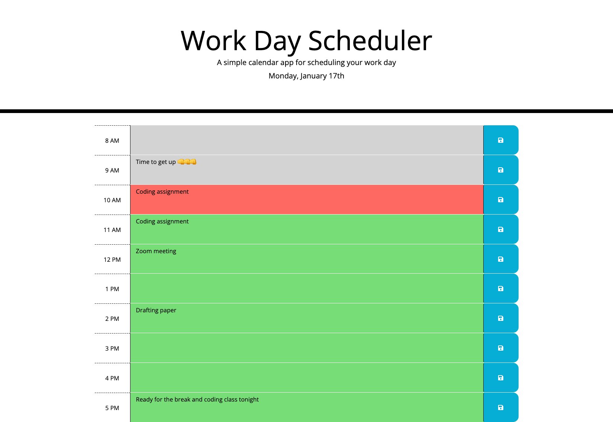
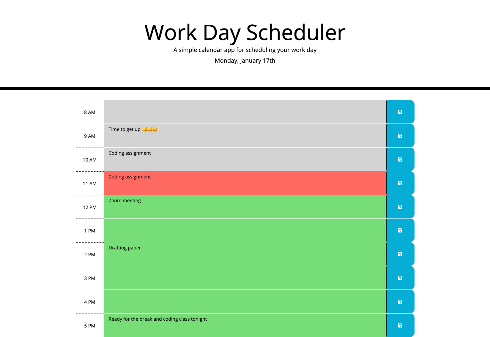

# 🖥 ScheduledDay
A managerial app for individuals to schedule a personal work day 

## 📋 Description 

This project is to create an interactive and user friendly (responsive) app of a lived calendar called "ScheledDay" and enabling the public in need of better planning and managing their current day. A diverse range of activities can be scheduled and stored into each hour between 8am and 5pm. Three colours are given for the current hour to be hilighted as red, the past as grey and the coming ones as green. Users can thus learn the current time by opening this app where three different colors of hilights to lable the past, present and future are in place.

### 👀 Key Features 

+ ⚓ Clear interface for users to schedule and store their plans of the present day
+ ⚓ Time and date are updated lively
+ ⚓ Events can be stored and reviewed regardless of refreshing the webpage or app
+ ⚓ Clean and polish layout easily for operation
+ ⚓ Easy for updation on dinamical modification of HTML, CSS and javascript

## 📷 Screenshot 

@10 am

@11 am

## 🔗 Link

https://chentriangoes.github.io/ScheduledDay/
